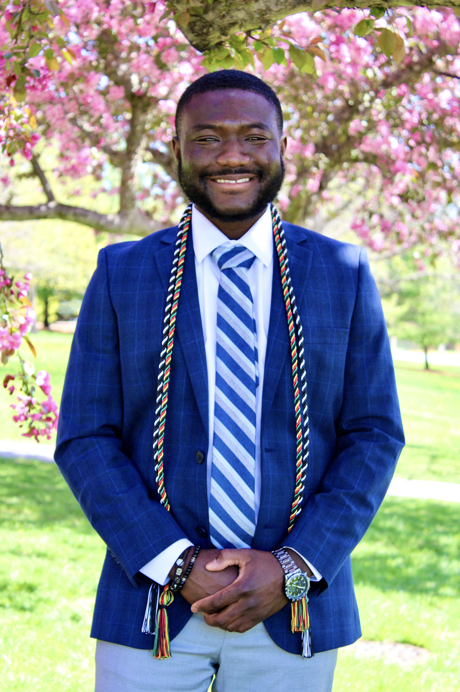

# Hi, I'm Peacebridge 👋🏾💡

**PEACEBRIDGE**  
Software Engineer, Problem Solver & Community Builder

I'm a software engineer who is passionate about making technology accessible, creating tools that empower people, and building strong tech communities. I enjoy working with technologies like JavaScript, Python, and cloud platforms. My mission is to use software to solve real-world problems and inspire others to learn and grow in tech.

In recent years, I've contributed to several open-source projects, mentored aspiring developers, and spoken at local meetups. I believe in the power of collaboration and continuous learning.

**Find me around the web 🌍:**

- Sharing insights on [LinkedIn](https://linkedin.com/in/peacebridge1/) 💼
- Contributing to open source on [GitHub](https://github.com/Yeboah-Peacebridge-Osei) 🚀
- Personal website: [peacebridge.dev](https://peacebridge.dev) 🌐

---
*Building tech to elevate people. Always learning, always sharing.*
